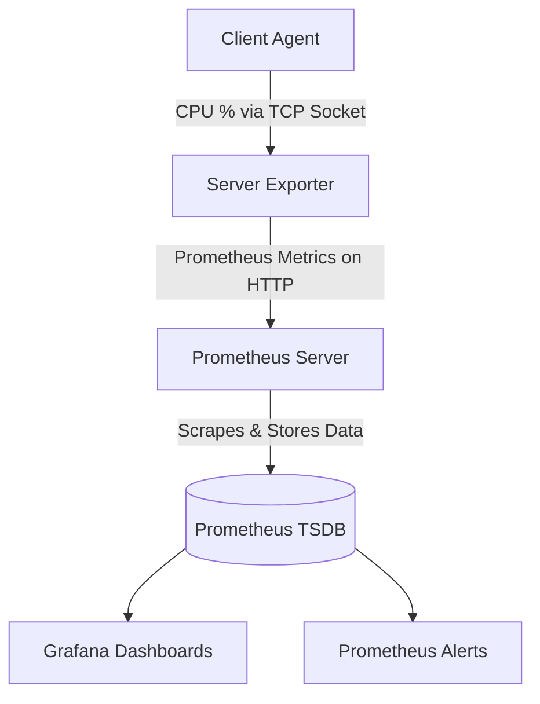

# 🖥️ Prometheus CPU Monitor Agent

A lightweight and efficient client-server system built with Python to collect real-time CPU utilization metrics and expose them for **Prometheus** monitoring. This project demonstrates a practical integration of custom application metrics into the Prometheus ecosystem, perfect for learning, prototyping, or small-scale monitoring.

## 📊 Overview

This project provides a hands-on example of how to bridge custom application data into a modern monitoring stack. It consists of two main components:

-   **🤖 Client Agent (`client.py`)**: A Python script that runs on the target machine you wish to monitor. It samples CPU usage and sends this data to a central server.
-   **🔌 Server Exporter (`server.py`)**: A Python-based server that receives data from clients and transforms it into Prometheus-formatted metrics, making them available for scraping.

The collected data can be used to create dynamic dashboards in **Grafana** or set up alerts in **Prometheus**, giving you deep insights into your system's performance.

### 🔄 Architecture Flow


## ⚙️ How It Works
Client (`client.py`): Connects to the server via a TCP socket. It continuously measures the CPU usage percentage using `psutil` and sends the data as a JSON object.

Server (`server.py`): Listens for client connections. It receives the CPU data and updates a Prometheus Gauge metric. It also runs an HTTP server to expose the `/metrics` endpoint.

Prometheus: Scrapes the metrics from the server's HTTP endpoint and stores the time-series data.

## 🛠️ Installation & Usage
### Prerequisites
* Python 3.6+

* pip

* Prometheus

**1. Clone the Repository**
``` bash
git clone https://github.com/your-username/prometheus-cpu-monitor-agent.git
cd prometheus-cpu-monitor-agent
```
**2. Install Python Dependencies**
``` bash
pip install psutil prometheus-client
```
**3. Run the Server**
``` bash
python server.py
```
**4. Run the Client**
In a separate terminal:

``` bash
python client.py
```
**5. Configure and Run Prometheus**
Use the provided `prometheus.yml` config and run:

``` bash
./prometheus --config.file=prometheus.yml
```
## 📈 Metric Exported
The server exports a Prometheus Gauge metric:

* Name: `my_cpu_percents`

* Description: `Percentage of CPU usage in gauge`

* Labels: `method`, `endpoint`

## 🤔 Why a Gauge?
The choice of a **Gauge** metric type was intentional. A `Gauge` can go up and down, which is the exact behavior of CPU utilization (e.g., 14.6%, 7.3%, 35.7%). A `Counter` only increases, and `Summary`/`Histogram` are for data distribution, making the Gauge the correct tool for this job.

## 📸 Example Output
### Client Terminal Output:

``` bash
YOU HAVE BEEN CONNECTED
("THE PERECENTAGE OF CPU USAGE": 14.6)
("THE PERECENTAGE OF CPU USAGE": 7.3)
("THE PERECENTAGE OF CPU USAGE": 5.4)
```
## 📁 Project Structure
``` bash
prometheus-cpu-monitor/
├── client.py
├── server.py
├── prometheus.yml
└── README.md
```
